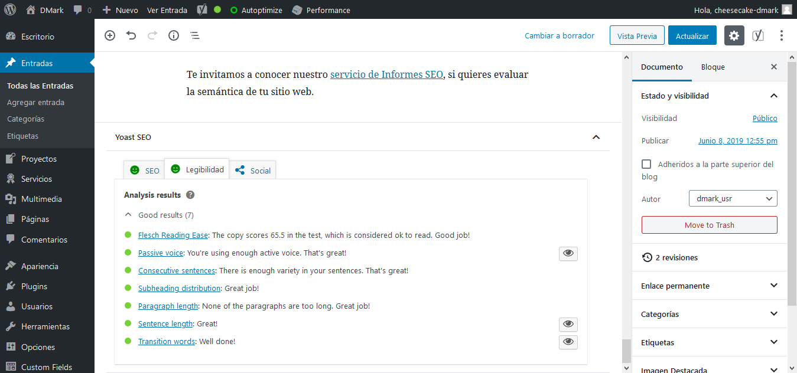

# Desafío: Oficio, Portal de búsqueda de oficios

### URL del sitio: [http://g4e7.desafiolab.com/oficios/](http://g4e7.desafiolab.com/oficios/)

### Usuario y contraseña creado
    Usuario: cheesecake-dmark
    Contraseña: BCR_m0R/12e2k19

## Optimización y seguridad en el sitio:
* Se utiliza claves robustas y complejas.
* Reducción de permisos en wp-config (600).
* Se reemplaza el archivo .htaccess para evitar accesos a terceros y comprimir archivos de texto.
* Instalación y configuración de Wordfence Security. Se realiza escaneo y se aplican las recomendaciones del plugin.
* Instalación de Smush, para reducir el tamaño de las imágenes y optimizar la velocidad de carga.
* Instalación de Autoptimize, para optimizar y minificar el código CSS, JS, imágenes, etc.
* Instalación de W3 Total Caché
* Se optimizan los articulos para SEO con el plugin Yoast SEO
* Se integra Sitemap y para uso de Google Console.

## Resultados de evaluación de optimización según GTMetrix:
#### Resultado anterior a la aplicación de plugins optimización:

#### Resultado posterior a la aplicación de plugins optimización:
 El resultado de la velocidad de la página sube de 83% a 88% mientras que el puntaje YSlow aumentó de 79% a 86%.

##Entrada 1:
####Análisis SEO y legibilidad inicial

####Análisis SEO y legibilidad optimizados

##Entrada 2: 
####Análisis SEO y legibilidad inicial

####legibilidad optimizados

##Entrada 3: Optimizado de análisis SEO y legibilidad

## Integración de Sitemap en Google Search Console:

### URL del sitemap: [http://g4e7.desafiolab.com/dmark/sitemap.xml](http://g4e7.desafiolab.com/dmark/sitemap.xml)
